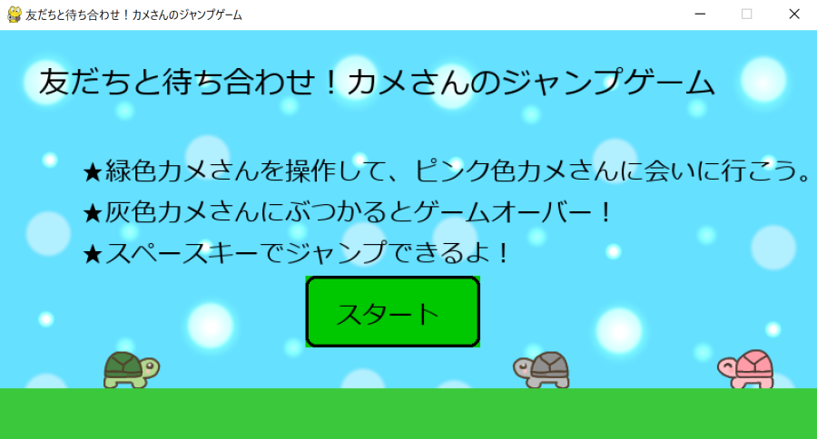

# 友だちと待ち合わせ！カメさんのジャンプゲーム
スペースキーを使いジャンプで敵のカメさんをよけながら友達のカメさんに会いに行く、ほのぼのしたゲームです。 
使用言語は、Pythonです。 
まず自分で調べながらコードを書いてみて、期待通りの動作をしない場合にCopilotの力を借りました。
## 操作方法
スペースキー：ジャンプ 
※プレイヤーのカメさんは自動的に右方向に向かって進みます。 
※敵のカメさんにぶつからないように、タイミングよくスペースキーを押してください。 
## 実行方法
1. リポジトリ内の「turtle_game」フォルダをダウンロードします。
2. ダウンロードしたフォルダの「main_lev001.exe」ファイルをダブルクリックして起動します。
## スクリーンショット
ゲーム画面のイメージです。

